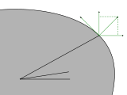

---
jupyter:
  jupytext:
    text_representation:
      extension: .md
      format_name: markdown
      format_version: '1.3'
      jupytext_version: 1.16.6
  kernelspec:
    display_name: Python 3 (ipykernel)
    language: python
    name: python3
---



```python
from sympy import *
```

```python
phi = Symbol("\\varphi")
omega = Symbol("omega")
alpha_l = Symbol("alpha_l", positive=True)
beta_n_l = Symbol("\\beta_{\\perp l}", positive=True)
beta_t_l = Symbol("\\beta_{||l}", positive=True)
ds_n = Symbol("ds_{\\perp}")
ds_t = Symbol("ds_{||}")
dx_p = Symbol("dx_P")
dy_p = Symbol("dy_P")
```

```python
dir_n = omega + phi + (beta_n_l + alpha_l - pi)
dir_n
```

```python
dir_t = (pi - beta_t_l - alpha_l) - omega - phi
dir_t
```

```python
dx_n = ds_n * cos(dir_n)
dx_n
```

```python
dy_n = ds_n * sin(dir_n)
dy_n
```

```python
dx_t = -ds_t * cos(dir_t)
dx_t
```

```python
dy_t = ds_t * sin(dir_t)
dy_t
```

```python
dx = dx_p + dx_n + dx_t
dx
```

```python
dy = dy_p + dy_n + dy_t
dy
```

```python

```
