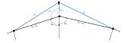

---
jupyter:
  jupytext:
    text_representation:
      extension: .md
      format_name: markdown
      format_version: '1.3'
      jupytext_version: 1.16.6
  kernelspec:
    display_name: Python 3 (ipykernel)
    language: python
    name: python3
---



```python
from sympy import *
```

```python
r = Symbol("r", positive=True)
ru = Symbol("r_u", positive=True)
rl = Symbol("r_l", positive=True)
au = Symbol("a_u", positive=True)
al = Symbol("a_l", positive=True)
alphau = Symbol("alpha_u", positive=True)
alphal = Symbol("alpha_l", positive=True)
betau = Symbol("beta_u", positive=True)
betal = Symbol("beta_l", positive=True)
gammau = Symbol("gamma_u", positive=True)
gammal = Symbol("gamma_l", positive=True)
ds = Symbol("ds")
```

```python
au_ = sqrt(au**2 + ds**2 - 2 * au * ds * cos(betau))
au_
```

```python
al_ = sqrt(al**2 + ds**2 - 2 * al * ds * cos(betal))
al_
```

```python
dG = (au_ - au) * gammau + (al_ - al) * gammal
dG
```

```python
dG_ds = limit(dG / ds, ds, 0)
dG_ds
```

```python
dV = au * ds * sin(betau) / 2 + al * ds * sin(betal) / 2
dV
```

```python
dV_ds = limit(dV / ds, ds, 0)
dV_ds
```

```python

```

```python

```
